# OpenHeat-Split

> 使用[朱雀固件](https://gitee.com/createskyblue/OpenT12)，PCB从[OpenHeat](https://github.com/peng-zhihui/OpenHeat)修改，主控引脚都不变，oled和编码器做成小板
>
> 该项目还包括热床外壳安装等~~一条龙服务~~
>
> 免责声明：不恰当的安装可能危及您的生命安全，请确保有一定的强电安全知识！

## 控制板

- 使用0603封装、可靠性高的连接器
- oled和编码器做成单独的小板子，oled目前是1.3寸，可换2.42寸的（暂未画板，有能力的话可以自己做）
- 控制热床加热的MOS：使用便宜又大碗的TO-247封装的管子
- 推荐工作电压12~24V，电流小于18A

|  | 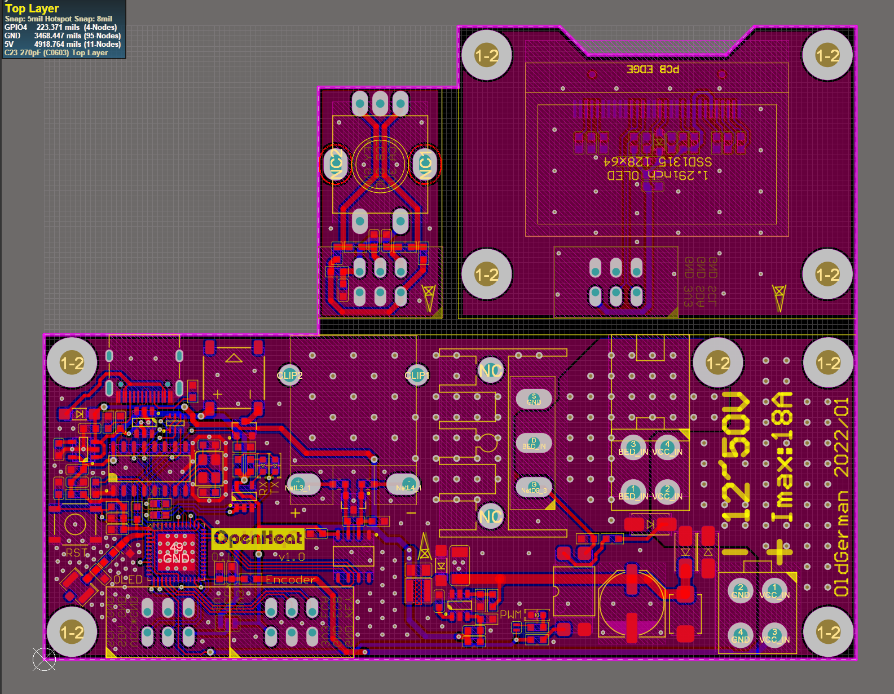 |
| -------------------------------------- | -------------------------------------- |

注：PCB为双面板，板厚1.6mm，需要分板，用壁纸刀沿着白线多划几下掰断，或者锯子伺候

| 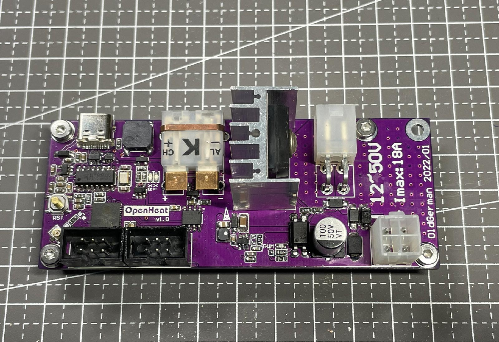             | 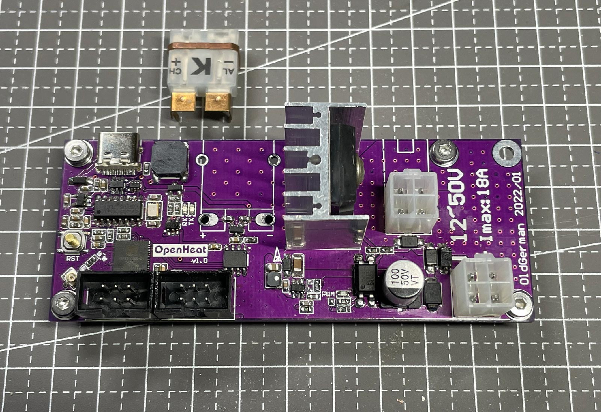                                      |
| ----------------------------------- | ------------------------------------------------------------ |
| 接热床的4针端子使用90度的5569连接器 | 接热床的4针端子也可用垂直的5566连接器 若不安装K型热电偶连接器，可将热电偶丝直接焊接在焊盘上 |

## 热床

[GeekStart展硕](https://oshwhub.com/GeekStartzhan-shuo/GSH_Bed-lv-ji-ban-jia-re-ping-tai)设计的GSH Bed 12V150W版本，线宽28.347mil，实测12V只能加热到185度且此温度下功率约85W

我修改了该设计，将线加宽到43mil，两侧铜带开窗，使用类似探针方式的接触（免焊接），可通过配置“顶针”位置来兼容12V或24V，热床维持200度时功率约100W，维持230度功率约140W

| 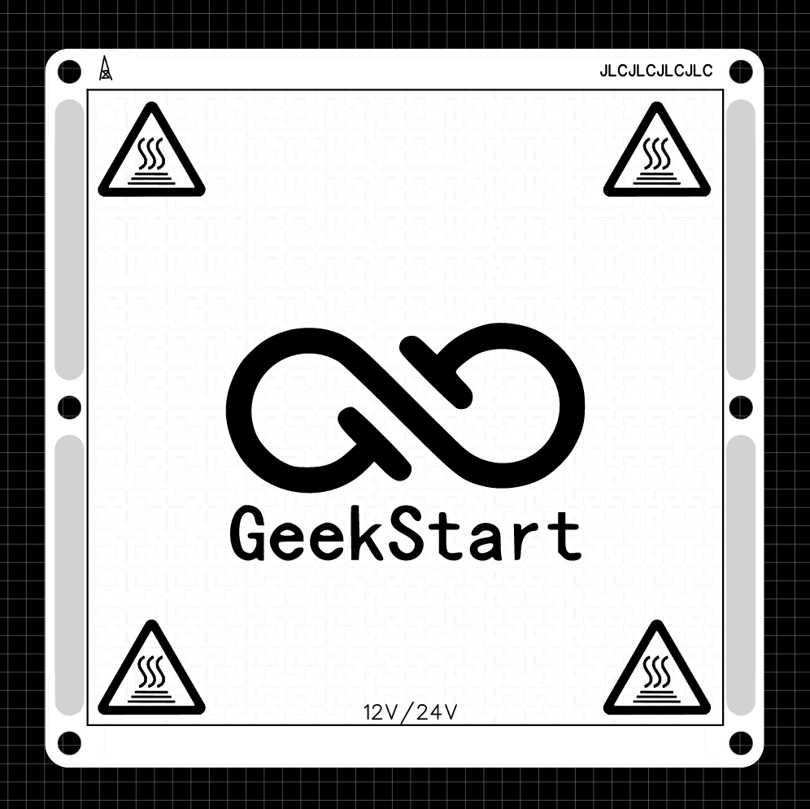 | 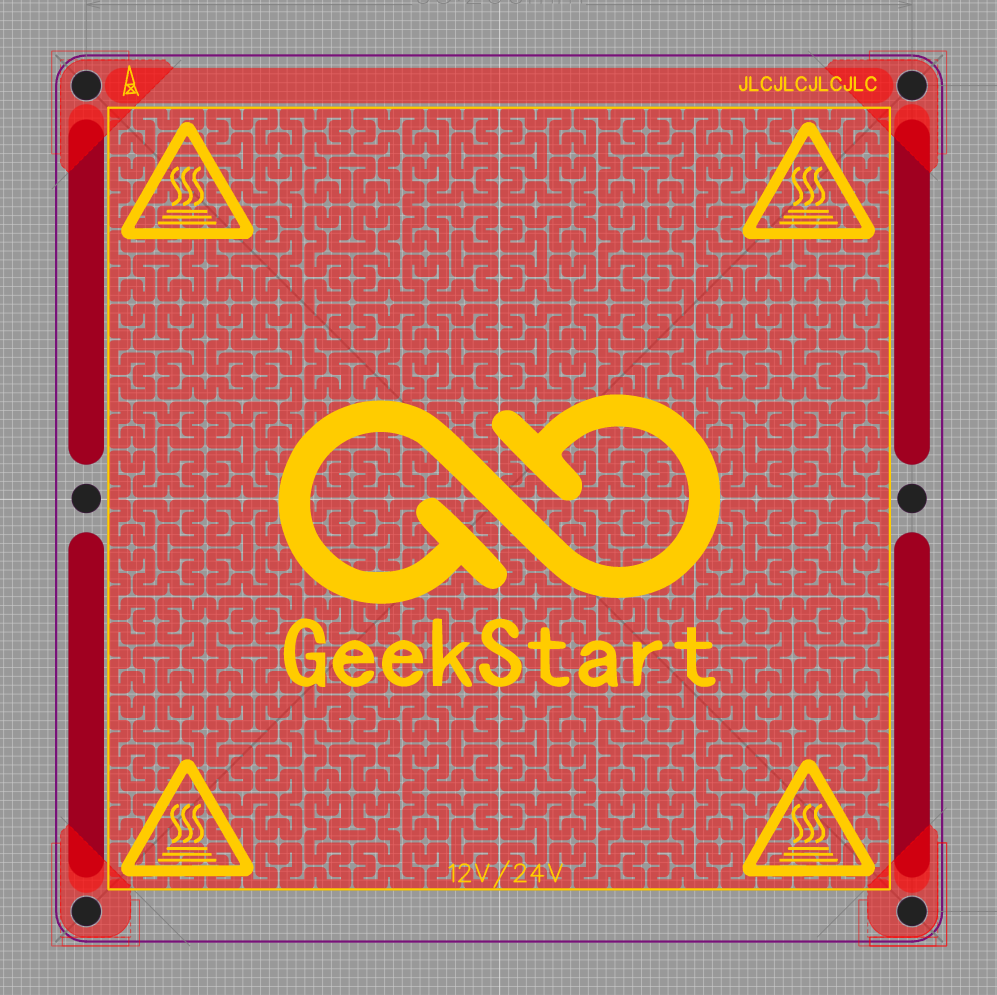 |
| ------------------------------------------------------------ | ------------------------------------------------------------ |

### 升温测试

| 修改前：线宽28mil、Vin= 12.7V、T环境 = 10℃，2段PID | 修改后：线宽43mil、Vin= 12.7V、T环境 = 10℃，3段PID |
| ------------------------------------------------------------ | ------------------------------------------------------------ |
| .png) | .png) |

## 顶针PCB

| 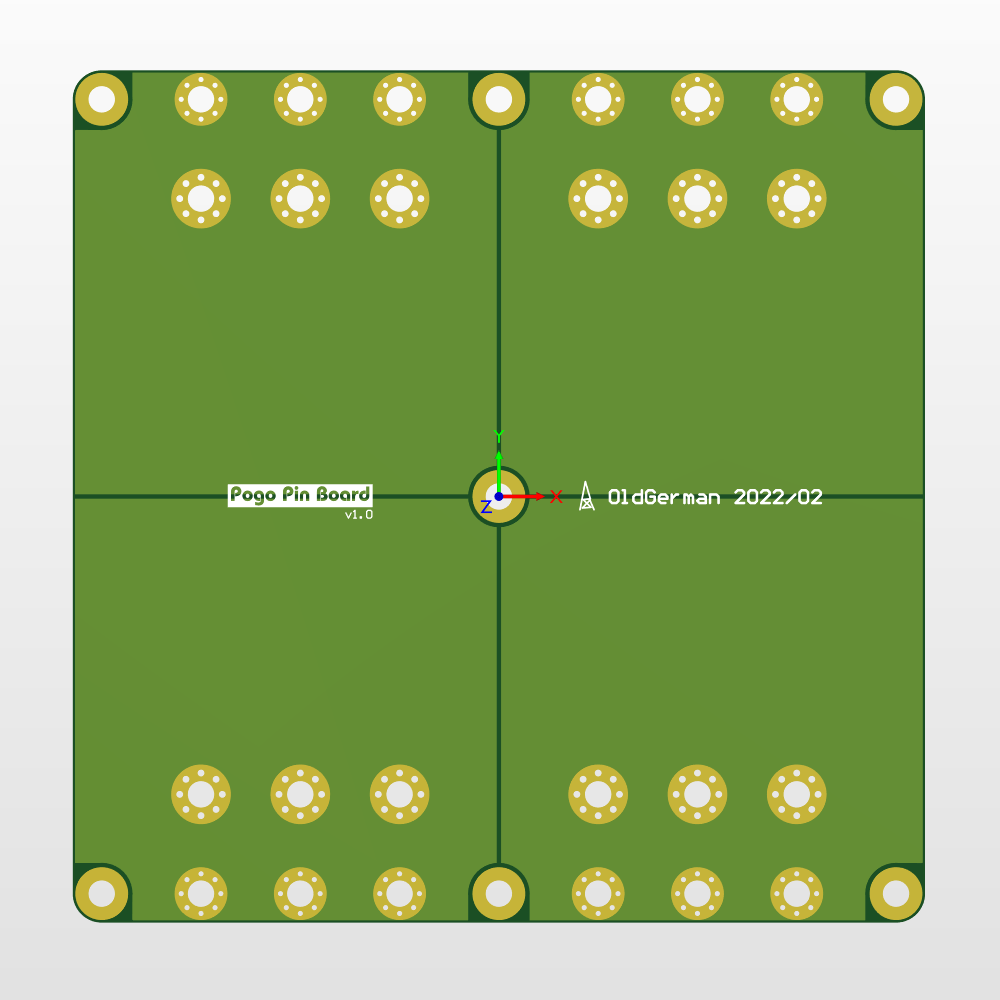 | 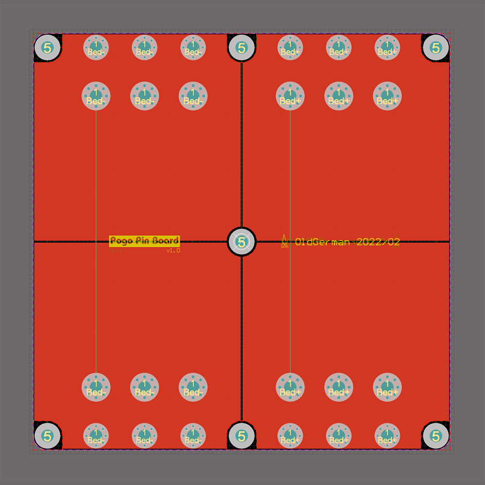 |
| ------------------------------------------------------- | ------------------------------------------------------- |

### 为什么需要这块板？

1. 在铝基板和壳体之间隔热
2. 铝基板导热太强，供电线十分难焊接，且200度左右焊锡会软化
2. 我使用过[华容5A电流探针](https://item.taobao.com/item.htm?id=555813649830)与热床接触，探针铜镀金的，导热很快，当热床200度以上时探针内部的弹簧会失去弹性，使探针报废

### 顶针的位置

所以使用探针的计划翻车了，改用纯螺柱代替探针的接触方式，手搓铜柱顶住热床就行，这种接触方式姑且叫顶针吧，顶针用的螺丝螺柱的具体规格请见后文的 安装图：上壳体

可以通过配置顶针位置，使铝基板热床工作在12V或24V（许多3D打印机热床也有类似的设计），12V使用8枚顶针，24V使用4枚顶针

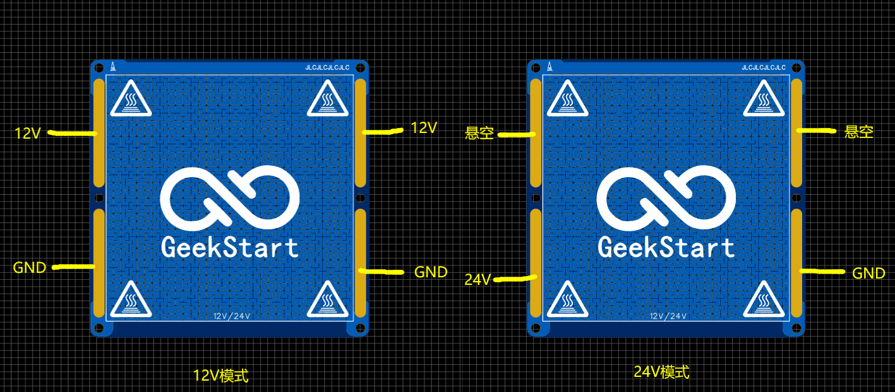

## 外壳

裸板并不意味着经久耐用，寻找合适的外壳是件头疼的事情
使用铝型材外壳，规格125×51×100mm，价格差不多15包邮，需要按开孔图开孔

### PCB尺寸

|             | 尺寸（mm) | M3孔距（mm) |
| ----------- | --------- | ----------- |
| 主控板      | 100×40    | 93.2×33.2   |
| 1.3寸OLED板 | 49×36     | 43×27       |
| 铝基板热床  | 100×100   | 93.2×93.2   |

为了做到安装不冲突，你可能需要修改本项目PCB源文件：最可能改动的是OLED小板的连接器位置，可见它并不居中，因为我根据目前用的CLP0212电源的尺寸做了修改，以防安装冲突

### 开关电源

电源可选型号如下，这类电源的尺寸大约是100×50mm，可以非常紧凑地安装在铝壳内

|                                      | 开关电源                                                     | 被动/主动散热功率(W) | 尺寸（mm)        | 孔距（mm)   | 加格(￥)@包邮 | 适配铝壳尺寸（mm) |
| ------------------------------------ | ------------------------------------------------------------ | -------------------- | ---------------- | ----------- | ------------- | ----------------- |
| 厚度偏薄，利于前面板的模块安装       | 金升阳 LOF225 20bXX                                          | 140/225              | 101.6×50.8×25.4  | 95.25×44.45 | 155           | 125×51×100        |
| 厚度偏厚，非常不利于前面板的模块安装 | 明纬 EPP-200-XX                                              | 140/200              | 101.6×50.8×32    | 95.25×44.45 | 214           | 125×51×100        |
| 过气方案                             | GE [CLP0212](https://library.industrialsolutions.abb.com/publibrary/checkout/CLP0212?TNR=Data%20Sheets%7CCLP0212%7CPDF) 12V | 100/200              | 101.6×50.8×37.14 | 93.2×42.4   | 45~196        | 125×51×100        |
| 又不是不能用                         | [WX-DC2416](https://m.tb.cn/h.fQLvrV4?sm=300ae6)             | 150/220              | 115×65×3.5       | 105.8×55.7  | 35            | 125×51×110        |

[参考：200W超小ITX电源 明纬EPP200-12性能测试](https://www.bilibili.com/read/cv14154464)

### 安装

|        |           | 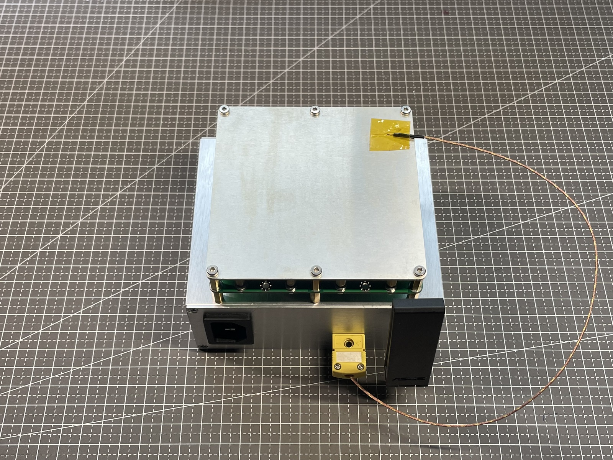          |
| ------ | -------------------------------- | -------------------------------- |
|        | 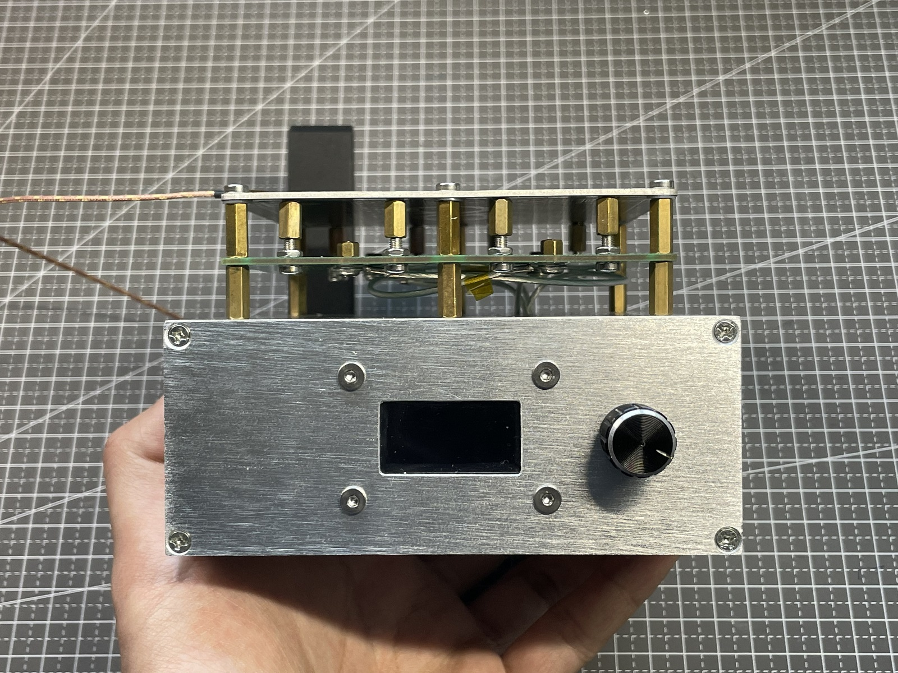          | 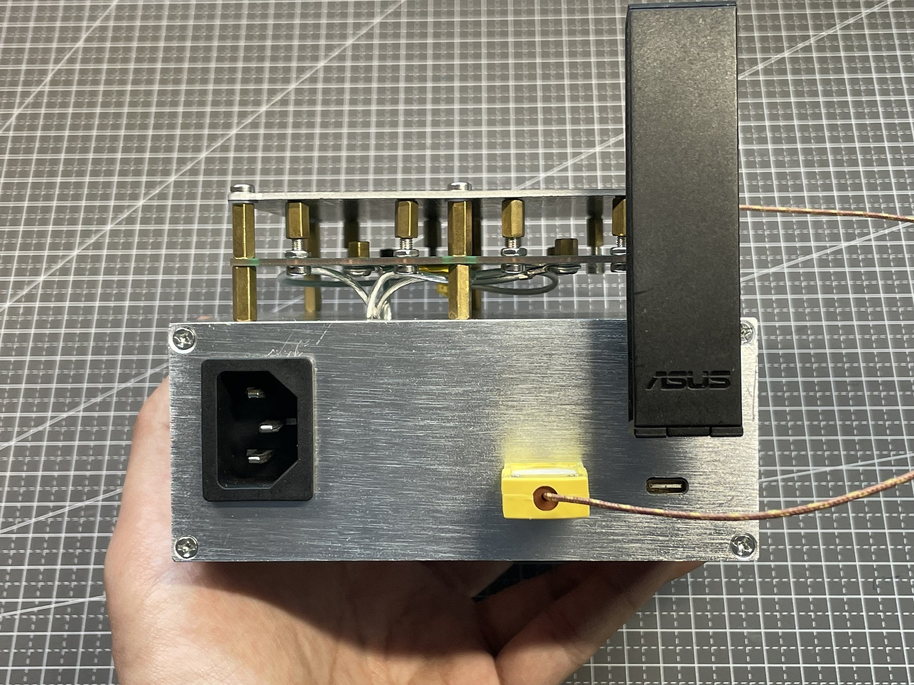          |
|        | 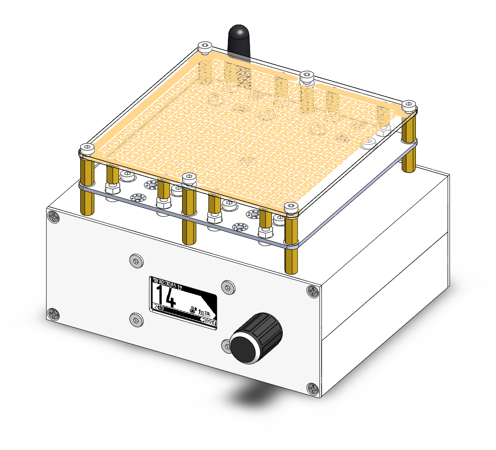            | 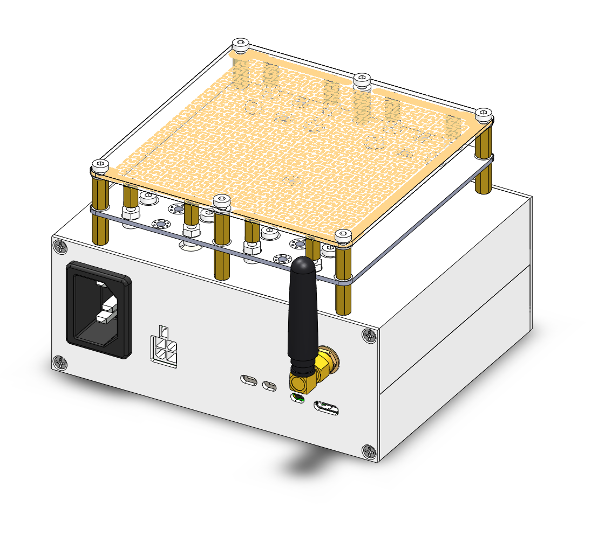            |
| 前面板 |  | 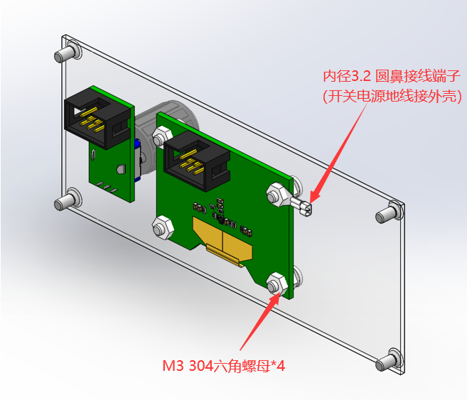 |
| 后面板 | 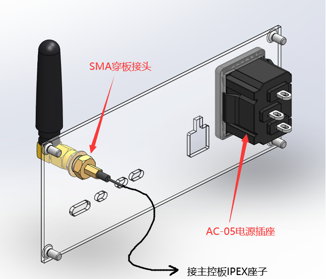 | 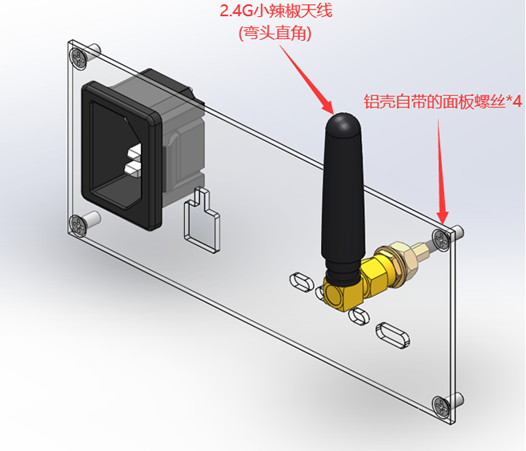 |
| 下壳体 | 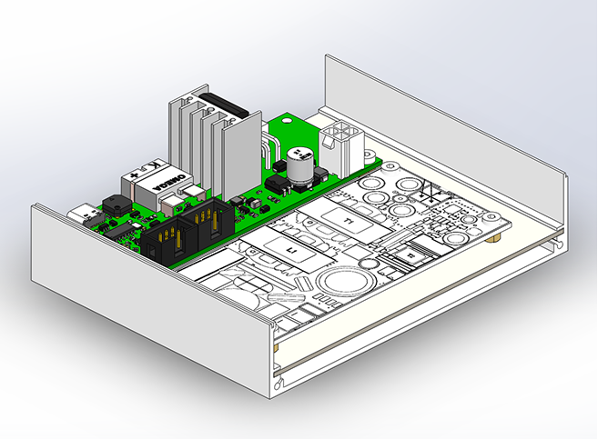     | 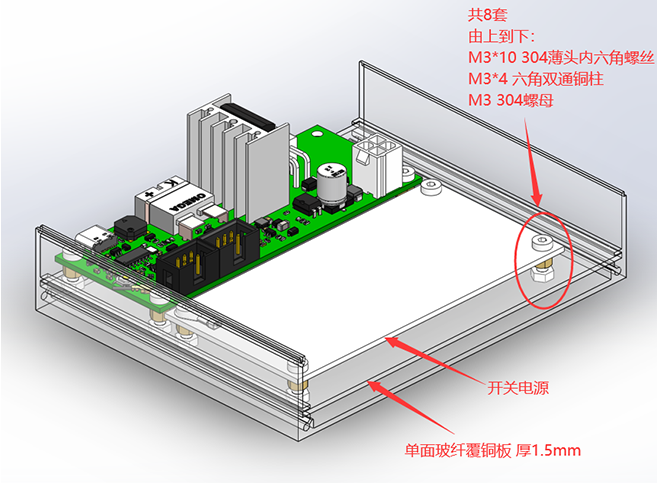 |
| 上壳体 | 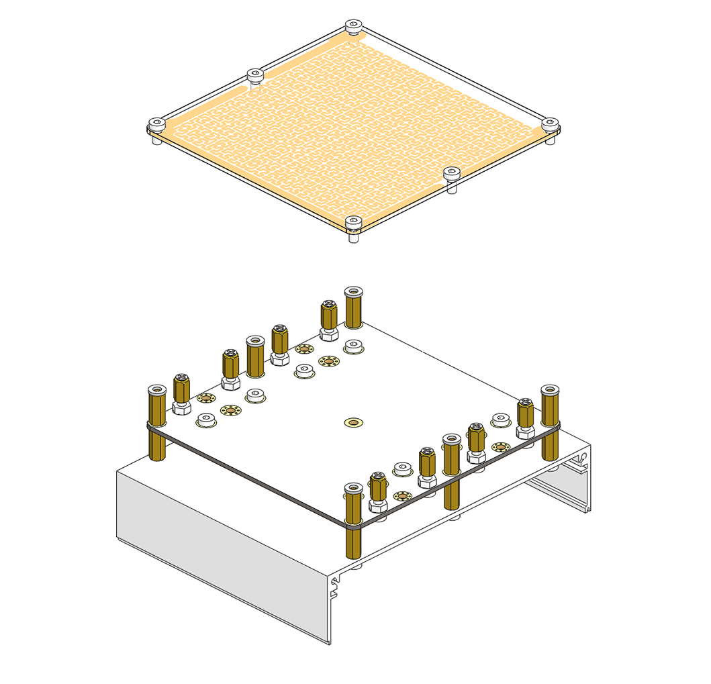     | 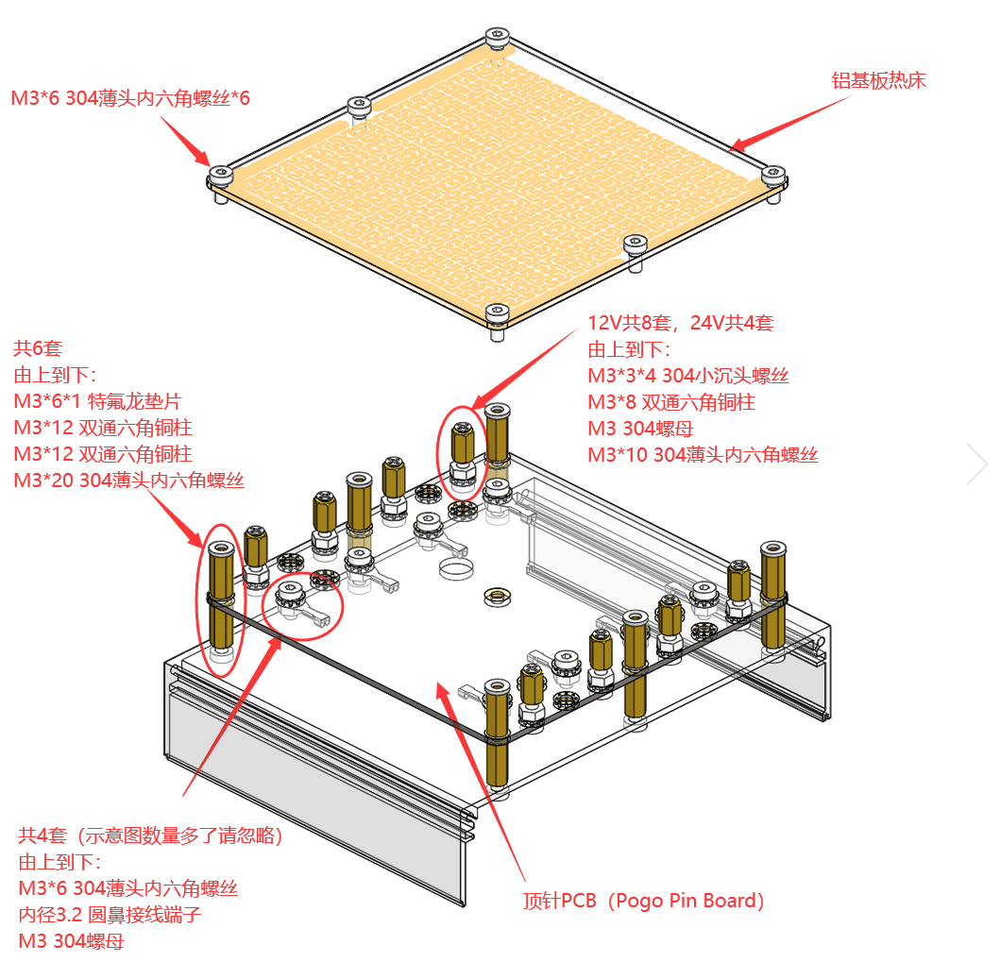 |

### 接地、绝缘

- 热床四个角的铜柱上必须安装特氟龙垫片（绝缘且耐240度高温），该垫片可以用规格3*6mm的特氟龙管手工切割制作
- AC-05电源插座务必外套绝缘管
- AC-05电源插座的地线、开关电源PCB的接地专用的固定孔、oled显示屏螺丝处的外壳接地点，三个接地点务必可靠连接
- 开关电源是裸板，PFC的MOS电压可达380V以上，需注意开关电源板边沿与铝制外壳的距离

### 铝壳开孔

控制板接热床可选两种连接器，对应不同的引出线方式：

- 若使用5569连接器，热床的电线从后面板引出
- 若使用5566连接器，热床的电线从上壳体圆洞引出

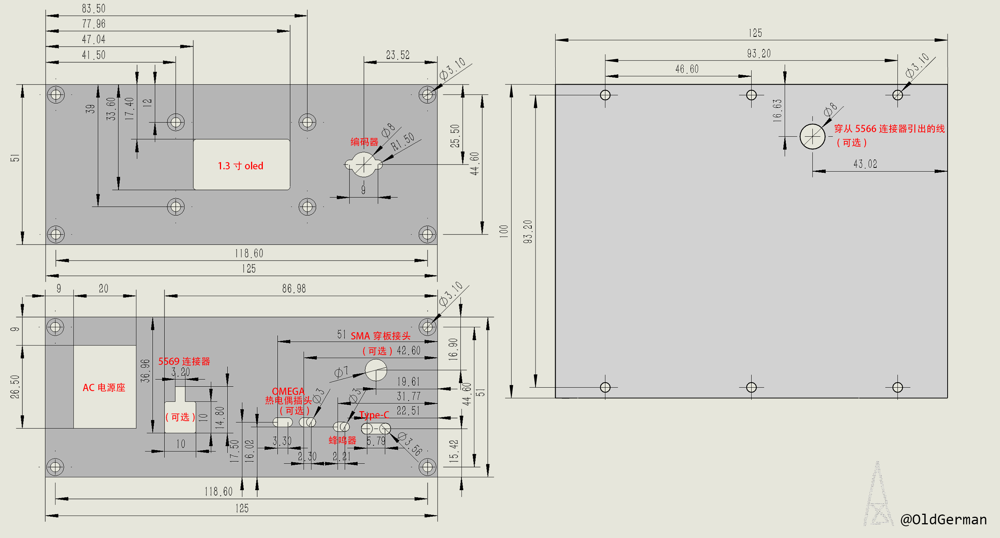

### 抽拉板开孔

| 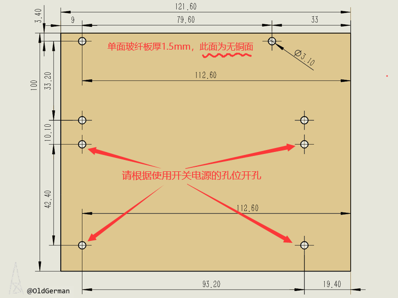 | 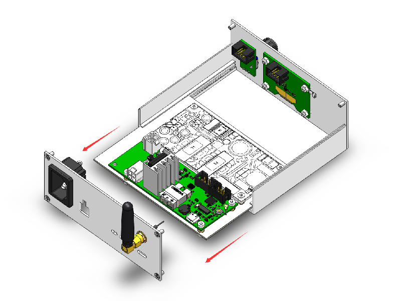 |
| -------------------------------------- | --------------------------------------- |

## 程序

### 烧录前的准备工作

[B站谢培宇x 适配好了MAX6675](https://b23.tv/DqndTQK)，[程序](https://pan.baidu.com/s/1FN_KfvtdgoIdXALv11UErQ) 提取码: 7fx5，VsCode环境搭建&程序烧录推荐看他的视频教程

### 热床功率过大导致开关电源限流保护

朱雀原程序有两组可配置的PID，一组负责爬升期，一组负责接近期

虽说推荐使用的200W以上的开关电源，但探针版GSH_Bed热床在0温升时，功率约288W，因此常温时若直接通电，程序直接按爬升区计算，使开关电源全功率加热，会触发开关电源短路保护

减小热床线宽可以降低电流，但测试43mil线宽热床，维持230度时PID输出的占空比在84%~100%之间波动，减小热床线宽可能会无法维持到230度

#### 方法1

增加一组可配置的预备期PID和预备温度，用于预备升温，等温度升高到热床内阻增大到 开关电源全功率负载不会触发短路保护时，再切换为爬升区PID，修改后的程序在 Firmware 文件夹内，预备期PID的值需要需要根据电源测试

#### 方法2

尝试修改温控曲线，限制最大输出功率，但目前曲线部分代码有显示问题，等本id有空试试

## Tips

1. 热床工作温度？
   请特别注意铜箔与铝板之间的绝缘层在260度以上会失效，建议工作温度不超过240度，建议黑色阻焊，或无阻焊
   
2. 热床阻焊层变黄？

   铝基板热床是消耗品，测试在环境温度10℃时，温度在180度时白油阻焊层几乎不会变黄，200度左右开始泛黄

3. 热床表面残留的的助焊剂污渍洗板水洗不掉？

   用800目砂纸稍加打磨

